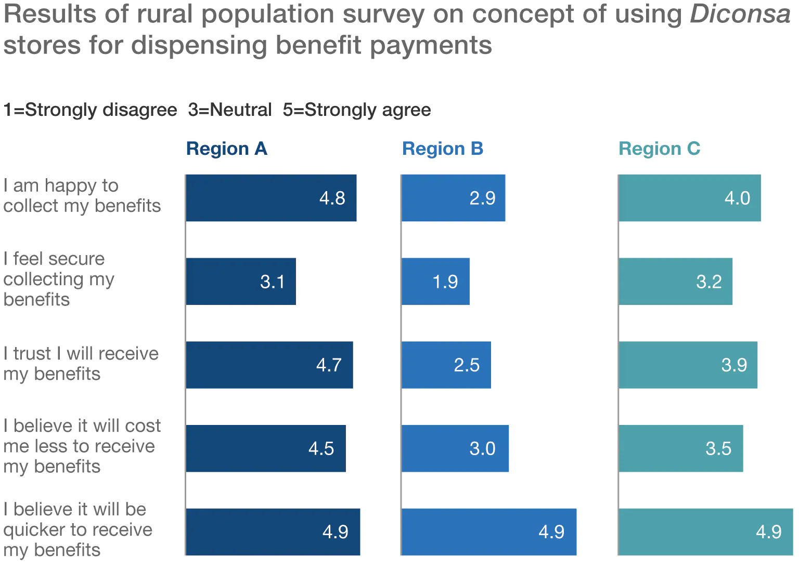
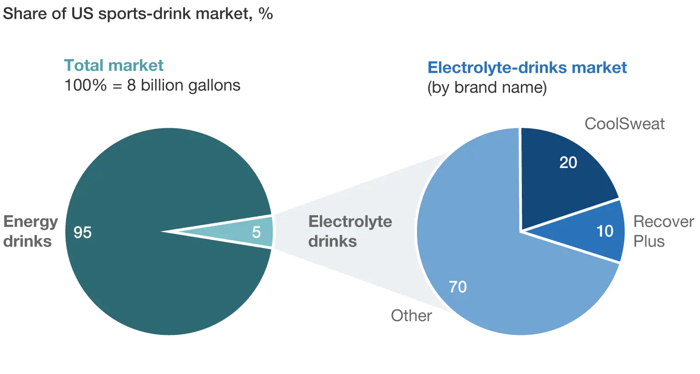
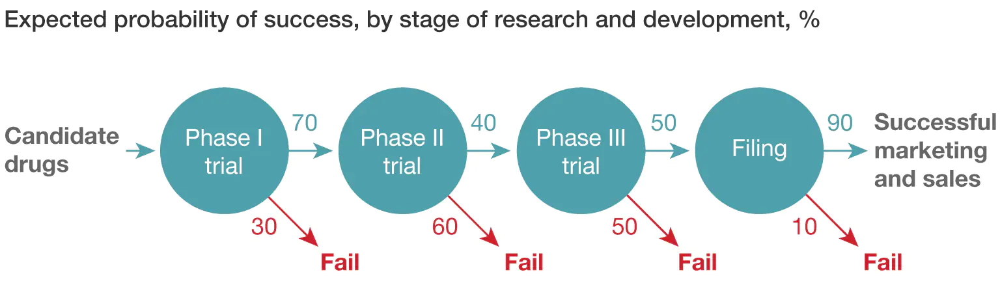
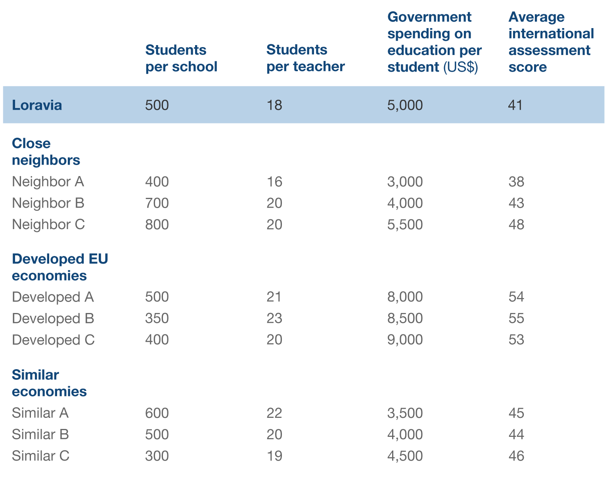
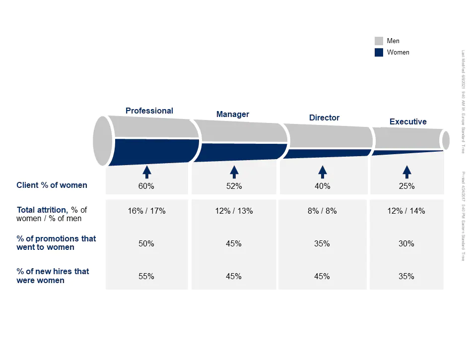

# Table of Contents

-   [Introduction](#introduction){#toc-introduction}
-   [Why Consulting](#why-consulting){#toc-why-consulting}
-   [McKinsey -
    Beautify](#mckinsey---beautify){#toc-mckinsey---beautify}
    -   [**Client Goal**](#client-goal){#toc-client-goal}
    -   [Situation
        description](#situation-description){#toc-situation-description}
    -   [**McKinsey Study**](#mckinsey-study){#toc-mckinsey-study}
    -   [**Question 1:**](#question-1){#toc-question-1}
    -   [**Answer**](#**Answer**){#toc-**Answer**}
    -   [**Question 2:**](#question-2){#toc-question-2}
    -   [**Answer**](#**Answer**-1){#toc-**Answer**-1}
    -   [**Question 3:**](#question-3){#toc-question-3}
    -   [**Answer**](#**Answer**-2){#toc-**Answer**-2}
-   [McKinsey - Diconsa](#mckinsey---diconsa){#toc-mckinsey---diconsa}
    -   [**Client Goal**](#client-goal-1){#toc-client-goal-1}
    -   [Situation
        description](#situation-description-1){#toc-situation-description-1}
    -   [**McKinsey Study**](#mckinsey-study-1){#toc-mckinsey-study-1}
    -   [**Question 1:**](#question-1-1){#toc-question-1-1}
    -   [**Answer**](#**Answer**-3){#toc-**Answer**-3}
    -   [**Question 2:**](#question-2-1){#toc-question-2-1}
    -   [**Answer**](#**Answer**-4){#toc-**Answer**-4}
    -   [**Question 3:**](#question-3-1){#toc-question-3-1}
    -   [**Answer**](#**Answer**-5){#toc-**Answer**-5}
    -   [**Question 4:**](#question-4){#toc-question-4}
    -   [**Answer**](#**Answer**-6){#toc-**Answer**-6}
-   [McKinsey -
    Electro-Light](#mckinsey---electro-light){#toc-mckinsey---electro-light}
    -   [**Client Goal**](#client-goal-2){#toc-client-goal-2}
    -   [Situation
        description](#situation-description-2){#toc-situation-description-2}
    -   [**McKinsey Study**](#mckinsey-study-2){#toc-mckinsey-study-2}
    -   [**Question 1:**](#question-1-2){#toc-question-1-2}
    -   [**Answer**](#**Answer**-7){#toc-**Answer**-7}
    -   [**Question 2:**](#question-2-2){#toc-question-2-2}
    -   [**Answer**](#**Answer**-8){#toc-**Answer**-8}
    -   [**Question 3:**](#question-3-2){#toc-question-3-2}
    -   [**Answer**](#**Answer**-9){#toc-**Answer**-9}
-   [McKinsey -
    GlobaPharm](#mckinsey---globapharm){#toc-mckinsey---globapharm}
    -   [**Client Goal**](#client-goal-3){#toc-client-goal-3}
    -   [Description of
        situation](#description-of-situation){#toc-description-of-situation}
    -   [**McKinsey Study**](#mckinsey-study-3){#toc-mckinsey-study-3}
    -   [**Question 1:**](#question-1-3){#toc-question-1-3}
    -   [**Answer**](#**Answer**-10){#toc-**Answer**-10}
    -   [**Question 2:**](#question-2-3){#toc-question-2-3}
    -   [**Answer**](#**Answer**-11){#toc-**Answer**-11}
    -   [**Question 3:**](#question-3-3){#toc-question-3-3}
    -   [**Answer**](#**Answer**-12){#toc-**Answer**-12}
    -   [**Question 4:**](#question-4-1){#toc-question-4-1}
    -   [**Answer**](#**Answer**-13){#toc-**Answer**-13}
-   [McKinsey - National
    Education](#mckinsey---national-education){#toc-mckinsey---national-education}
    -   [**Client Goal**](#client-goal-4){#toc-client-goal-4}
    -   [Situation
        description](#situation-description-3){#toc-situation-description-3}
    -   [**McKinsey Study**](#mckinsey-study-4){#toc-mckinsey-study-4}
    -   [**Question 1:**](#question-1-4){#toc-question-1-4}
    -   [**Answer**](#**Answer**-14){#toc-**Answer**-14}
    -   [**Question 2:**](#question-2-4){#toc-question-2-4}
    -   [**Answer**](#**Answer**-15){#toc-**Answer**-15}
    -   [**Question 3:**](#question-3-4){#toc-question-3-4}
    -   [**Answer**](#**Answer**-16){#toc-**Answer**-16}
-   [McKinsey - Talbot
    Trucks](#mckinsey---talbot-trucks){#toc-mckinsey---talbot-trucks}
    -   [**Client Goal**](#client-goal-5){#toc-client-goal-5}
    -   [Situation
        description](#situation-description-4){#toc-situation-description-4}
    -   [**McKinsey Study**](#mckinsey-study-5){#toc-mckinsey-study-5}
    -   [**Question 1:**](#question-1-5){#toc-question-1-5}
    -   [**Answer**](#**Answer**-17){#toc-**Answer**-17}
    -   [**Question 2:**](#question-2-5){#toc-question-2-5}
    -   [**Answer**](#**Answer**-18){#toc-**Answer**-18}
    -   [**Question 3:**](#question-3-5){#toc-question-3-5}
    -   [**Answer**](#**Answer**-19){#toc-**Answer**-19}
-   [McKinsey - Shops
    Corporation](#mckinsey---shops-corporation){#toc-mckinsey---shops-corporation}
    -   [**Client Goal**](#client-goal-6){#toc-client-goal-6}
    -   [Description of
        situation](#description-of-situation-1){#toc-description-of-situation-1}
    -   [**McKinsey Study**](#mckinsey-study-6){#toc-mckinsey-study-6}
    -   [**Question 1:**](#question-1-6){#toc-question-1-6}
    -   [**Answer**](#**Answer**-20){#toc-**Answer**-20}
    -   [**Question 2:**](#question-2-6){#toc-question-2-6}
    -   [**Answer**](#**Answer**-21){#toc-**Answer**-21}
    -   [**Question 3:**](#question-3-6){#toc-question-3-6}
    -   [**Answer**](#**Answer**-22){#toc-**Answer**-22}
-   [McKinsey - Conservation
    Forever](#mckinsey---conservation-forever){#toc-mckinsey---conservation-forever}
    -   [**Client Goal**](#client-goal-7){#toc-client-goal-7}
    -   [Situation
        description](#situation-description-5){#toc-situation-description-5}
    -   [**McKinsey Study**](#mckinsey-study-7){#toc-mckinsey-study-7}
    -   [**Question 1:**](#question-1-7){#toc-question-1-7}
    -   [**Answer**](#**Answer**-23){#toc-**Answer**-23}
    -   [**Question 2:**](#question-2-7){#toc-question-2-7}
    -   [**Answer**](#**Answer**-24){#toc-**Answer**-24}
    -   [**Question 3:**](#question-3-7){#toc-question-3-7}
    -   [**Answer**](#**Answer**-25){#toc-**Answer**-25}
    -   [**Question 4:**](#question-4-2){#toc-question-4-2}
    -   [**Answer**](#**Answer**-26){#toc-**Answer**-26}
-   [Resources](#resources){#toc-resources}

-   [Introduction](#introduction){#toc-introduction}
-   [Why Consulting](#why-consulting){#toc-why-consulting}
-   [McKinsey -
    Beautify](#mckinsey---beautify){#toc-mckinsey---beautify}
    -   [**Client Goal**](#client-goal){#toc-client-goal}
    -   [Situation
        description](#situation-description){#toc-situation-description}
    -   [**McKinsey Study**](#mckinsey-study){#toc-mckinsey-study}
    -   [**Question 1:**](#question-1){#toc-question-1}
    -   [**Answer**](#**Answer**){#toc-**Answer**}
    -   [**Question 2:**](#question-2){#toc-question-2}
    -   [**Answer**](#**Answer**-1){#toc-**Answer**-1}
    -   [**Question 3:**](#question-3){#toc-question-3}
    -   [**Answer**](#**Answer**-2){#toc-**Answer**-2}
-   [McKinsey - Diconsa](#mckinsey---diconsa){#toc-mckinsey---diconsa}
    -   [**Client Goal**](#client-goal-1){#toc-client-goal-1}
    -   [Situation
        description](#situation-description-1){#toc-situation-description-1}
    -   [**McKinsey Study**](#mckinsey-study-1){#toc-mckinsey-study-1}
    -   [**Question 1:**](#question-1-1){#toc-question-1-1}
    -   [**Answer**](#**Answer**-3){#toc-**Answer**-3}
    -   [**Question 2:**](#question-2-1){#toc-question-2-1}
    -   [**Answer**](#**Answer**-4){#toc-**Answer**-4}
    -   [**Question 3:**](#question-3-1){#toc-question-3-1}
    -   [**Answer**](#**Answer**-5){#toc-**Answer**-5}
    -   [**Question 4:**](#question-4){#toc-question-4}
    -   [**Answer**](#**Answer**-6){#toc-**Answer**-6}
-   [McKinsey -
    Electro-Light](#mckinsey---electro-light){#toc-mckinsey---electro-light}
    -   [**Client Goal**](#client-goal-2){#toc-client-goal-2}
    -   [Situation
        description](#situation-description-2){#toc-situation-description-2}
    -   [**McKinsey Study**](#mckinsey-study-2){#toc-mckinsey-study-2}
    -   [**Question 1:**](#question-1-2){#toc-question-1-2}
    -   [**Answer**](#**Answer**-7){#toc-**Answer**-7}
    -   [**Question 2:**](#question-2-2){#toc-question-2-2}
    -   [**Answer**](#**Answer**-8){#toc-**Answer**-8}
    -   [**Question 3:**](#question-3-2){#toc-question-3-2}
    -   [**Answer**](#**Answer**-9){#toc-**Answer**-9}
-   [McKinsey -
    GlobaPharm](#mckinsey---globapharm){#toc-mckinsey---globapharm}
    -   [**Client Goal**](#client-goal-3){#toc-client-goal-3}
    -   [Description of
        situation](#description-of-situation){#toc-description-of-situation}
    -   [**McKinsey Study**](#mckinsey-study-3){#toc-mckinsey-study-3}
    -   [**Question 1:**](#question-1-3){#toc-question-1-3}
    -   [**Answer**](#**Answer**-10){#toc-**Answer**-10}
    -   [**Question 2:**](#question-2-3){#toc-question-2-3}
    -   [**Answer**](#**Answer**-11){#toc-**Answer**-11}
    -   [**Question 3:**](#question-3-3){#toc-question-3-3}
    -   [**Answer**](#**Answer**-12){#toc-**Answer**-12}
    -   [**Question 4:**](#question-4-1){#toc-question-4-1}
    -   [**Answer**](#**Answer**-13){#toc-**Answer**-13}
-   [McKinsey - National
    Education](#mckinsey---national-education){#toc-mckinsey---national-education}
    -   [**Client Goal**](#client-goal-4){#toc-client-goal-4}
    -   [Situation
        description](#situation-description-3){#toc-situation-description-3}
    -   [**McKinsey Study**](#mckinsey-study-4){#toc-mckinsey-study-4}
    -   [**Question 1:**](#question-1-4){#toc-question-1-4}
    -   [**Answer**](#**Answer**-14){#toc-**Answer**-14}
    -   [**Question 2:**](#question-2-4){#toc-question-2-4}
    -   [**Answer**](#**Answer**-15){#toc-**Answer**-15}
    -   [**Question 3:**](#question-3-4){#toc-question-3-4}
    -   [**Answer**](#**Answer**-16){#toc-**Answer**-16}
-   [McKinsey - Talbot
    Trucks](#mckinsey---talbot-trucks){#toc-mckinsey---talbot-trucks}
    -   [**Client Goal**](#client-goal-5){#toc-client-goal-5}
    -   [Situation
        description](#situation-description-4){#toc-situation-description-4}
    -   [**McKinsey Study**](#mckinsey-study-5){#toc-mckinsey-study-5}
    -   [**Question 1:**](#question-1-5){#toc-question-1-5}
    -   [**Answer**](#**Answer**-17){#toc-**Answer**-17}
    -   [**Question 2:**](#question-2-5){#toc-question-2-5}
    -   [**Answer**](#**Answer**-18){#toc-**Answer**-18}
    -   [**Question 3:**](#question-3-5){#toc-question-3-5}
    -   [**Answer**](#**Answer**-19){#toc-**Answer**-19}
-   [McKinsey - Shops
    Corporation](#mckinsey---shops-corporation){#toc-mckinsey---shops-corporation}
    -   [**Client Goal**](#client-goal-6){#toc-client-goal-6}
    -   [Description of
        situation](#description-of-situation-1){#toc-description-of-situation-1}
    -   [**McKinsey Study**](#mckinsey-study-6){#toc-mckinsey-study-6}
    -   [**Question 1:**](#question-1-6){#toc-question-1-6}
    -   [**Answer**](#**Answer**-20){#toc-**Answer**-20}
    -   [**Question 2:**](#question-2-6){#toc-question-2-6}
    -   [**Answer**](#**Answer**-21){#toc-**Answer**-21}
    -   [**Question 3:**](#question-3-6){#toc-question-3-6}
    -   [**Answer**](#**Answer**-22){#toc-**Answer**-22}
-   [McKinsey - Conservation
    Forever](#mckinsey---conservation-forever){#toc-mckinsey---conservation-forever}
    -   [**Client Goal**](#client-goal-7){#toc-client-goal-7}
    -   [Situation
        description](#situation-description-5){#toc-situation-description-5}
    -   [**McKinsey Study**](#mckinsey-study-7){#toc-mckinsey-study-7}
    -   [**Question 1:**](#question-1-7){#toc-question-1-7}
    -   [**Answer**](#**Answer**-23){#toc-**Answer**-23}
    -   [**Question 2:**](#question-2-7){#toc-question-2-7}
    -   [**Answer**](#**Answer**-24){#toc-**Answer**-24}
    -   [**Question 3:**](#question-3-7){#toc-question-3-7}
    -   [**Answer**](#**Answer**-25){#toc-**Answer**-25}
    -   [**Question 4:**](#question-4-2){#toc-question-4-2}
    -   [**Answer**](#**Answer**-26){#toc-**Answer**-26}
-   [Resources](#resources){#toc-resources}

# Introduction

First and foremost, thank you for reading. You are doing a big favor to
yourself and your career for wanting to learn more and improve as a
person. I can guarantee you that the intuition developed from
understanding how to think through these cases will help you in your
career, even if you're not in consulting.

You might be wondering who I am so let me tell you a little bit about
myself.

I'm currently a consulting manager at a big consulting firm. I've been
working here for almost five years now, and it's been quite the journey.

I studied computer science and math in college, but didn't feel like a
traditional coding desk job fit my image of a fulfilling career. Sure, I
had a technical background, but what set me apart from my peers was that
I also loved to talk to people, enjoyed new, spontaneous experiences,
and getting my hands on a lot of different projects rather than
dedicating my life to one thing.

I couldn't relate when my peers were starry eyed about securing that
stationary coding job for the rest of their lives. I wanted to travel
and see the world, meet people from all different backgrounds and
cultures, and overall live an exciting life.

I had no idea how I was going to accomplish this since everyone told me
college would be the best four years of my life and that I would be dead
inside as soon as I started a real job. I also had no idea what I wanted
to do with my life after college and I thought the best way to find out
was to try a lot of things.

But I was told that switching jobs frequently would cost me my career,
so how was I going to try new things if I couldn't switch jobs every few
months?

I learned about consulting during my later years of college. I learned
that it was a career that allowed me to put my hands into many different
jars and figure out what I liked to do instead of commmiting to one
thing. It also aligned with what I was passionate about: coding,
analytics, and business. It also wasn't like a sales job where you
travel around and try to close deals. You have to be analytical and
impelement the best solutions.

It also happens to be a highly lucrative career.

In my five years doing consulting, I've been to most major cities in the
U.S. and a couple of foreign countries. I was able to rack up enough
points at hotels to let me live in an upscale hotel in my personal time
for more than a month. I had enough flight points to book me six round
trip flights from New York City to Los Angeles for free. Sure, there
were some sleepless nights when work needed to be done, but it was good
for character development and worth it in my opinion.

I would post my travels and accomadations on social media and my friends
who were working regular desk jobs would ask how I lived such an
exciting life. I was doing everything I've always wanted to do while
generating great income.

That's where I'm at right now at the time of this writing.

By purchasing this book, you are on my email list. Any updates to this
book will be sent your way. You will always have access to any
improvements or additional content I add to ensure that you have the
resources to be on top of your career.

# Why Consulting

In my experience, not many people outside of the consulting industry
actually know or understand what the profession is about.

For me, there are six key benefits working in the field.

1.  Great exposure

If you don't know what you want to do, consulting is a great place to
start. You are able to jump into a variety of projects and develop a
good sense of what you like and don't like to do. Based on this, you can
request certain types of projects down the road that fit your
preferences.

In a traditional job, you are typically hired to do one job and one job
only. If you don't like the job function, then the only way to change
what you do is by leaving the company.

In consulting, you can just leave the project and find another one. You
still will have your job and income, and do not need to interview
externally in addition to working during your working hours.

You also meet many different people by being exposed to a variety of
projects. You quickly learn how to assess situations, figure out who is
in charge of what, and overall develop your social intuition.

2.  Travel accommodations

In most cases consultants travel a lot, if not constantly. You need to
fly here for a client meeting, then there for a sales pitch, then back
home to work with your team on building out the solution.

For a lot of people that sounds unenticing because of things like family
obligations or homesickness. For others it sounds awesome because you
get paid to see the world and rack up hotel and flight points that can
be used for your personal vacations.

In a typical job, you would have to take paid time off (PTO) in order to
travel somewhere other than your home town, but as a consultant it can
be part of your job!

3.  Flexibility

You typically report to two entities as a consultant - your direct
manager in your consulting firm and the client. Your direct manager will
help you out if you need it, but you don't usually interact that often.
Your day to day work will be with the client.

This allows flexibility when choosing who you work with.

4.  Great exit opportunities

Since you're doing a wide variety of things, you learn to be competent
in many skills. You can decide what you want to become an expert in when
you find what interests you.

The connections you make with clients on projects are invaluable. They
often leave the client company you worked with and go to other great
companies, which gives you a solid, diverse network of people who think
highly of you.

It is also not uncommon for clients to offer high performing consultants
full-time jobs at wherever they may see fit.

For me, I've been on software engineering, advanced analytics, data
engineering, and project management roles, and I could steer my career
into any of those paths if I chose to do so. I have connections in each
of those industries as well to help with the transition.

5.  Develops good business sense - a skill that will propel you in any
    career.

Understanding how business make decisions will always be a great skill
to have. No matter what job or industry you work in, chances are you
work for some kind of business. In consulting, you get exposure to a
wide variety of business problems and have to think through how to best
solve them with often limited information.

You can bring that knowledge with you to wherever you go in your career
even if you choose to go into a technical field.

6.  High pay

Money ideally shouldn't be the most important thing when choosing a
career, but I had to list it on here. Many college grads get six figure
jobs right out of college and continue to double or triple their take
home salaries in just a couple of years.

------------------------------------------------------------------------

Alright, I've given you a brief introduction to consulting and described
the perks that make it a highly sought after career path.

The key to being successful in this industry is understanding how
businesses make decisions. To do that, you must go through many examples
of business cases to see common themes and patterns. Even if you aren't
in consulting, learning how to think through business problems will be
beneficial in any career path. There is value for everyone in this book.

The cases are not in any particular order. You can jump back and forth
as you please. I've compiled these cases from various sources from the
internet, so you don't have to.

Cool. Ready? Me too. Let the games begin.

# McKinsey - Beautify

**Client Goal**

Our client is Beautify. Beautify has approached McKinsey for help with
exploring new ways to approach its customers.

**Situation Description**

Beautify is a global prestige cosmetics company that sells its products
mainly inside high-end department stores such as Harrods and Shanghai
No. 1. It also has a presence online with specialty retailers like
Sephora. Beautify produces a number of makeup, fragrance, and skin care
products sold under several different brands.

In department stores, beauty consultants play a critical role with
consumers:

-   approaching "passive" customers
-   demonstrating their knowledge of the products
-   actively selling the products
-   maintaining a loyal customer base of repeat buyers

These consultants are hired directly by Beautify or through specialist,
third-party agencies that find new recruits for a fee. Beautify is then
responsible for selecting, training, and paying the consultants. Within
Beautify, beauty consultants are managed independently by each brand in
each country. For example, this may mean a consultant might be part of
the Chanel team in a store. However, consumers are shifting more to
online shopping, and too many beauty consultants are left working in
empty department stores.

**McKinsey Study**

Beautify's president and COO engaged McKinsey to help evaluate if
training the majority of beauty consultants to use virtual channels to
connect with customers could be profitable for the company.

**Question 1:**

Beautify is excited to support its current staff of beauty consultants
on the journey to becoming virtual social media-beauty advisors.
Consultants would still lead the way in terms of direct consumer
engagement and would be expected to maintain and grow a group of
clients. They would sell products through their own pages on
beautify.com, make appearances at major retail outlets, and be active on
all social media platforms.

What possible factors should Beautify consider when shifting this group
of employees toward a new set of responsibilities?

------------------------------------------------------------------------

**Answer**

Some of the factors you might discuss with your interviewer could
include:

Retailer response. How will retailers respond to consumers buying
directly from beautify.com? What kinds of financial arrangements will
Beautify have to work out with its retail partners?

Competitor response. Do other beauty companies offer virtual assistants?
If yes, how successful are they? If no, do they have plans to digitize
the personal selling experience?

Current capabilities. What is the current skill set of beauty
consultants regarding social media? How many already have an online
presence, for example, those with more professional accounts on social
media platforms or a personal beauty or skincare blog? Would it be
possible to hire new advisors with these marketing skills?

Brand image. What are the implications for Beautify's brand if hundreds
of advisors suddenly start posting about its products? How could this be
leveraged to make Beautify seem more attractive as an employer in the
market?

------------------------------------------------------------------------

**Question 2:**

One of the key areas that Beautify wants to understand is the reaction
of current and potential new customers to the virtual social
media-beauty advisors.

Imagine you are a current Beautify customer and you mostly shop at your
local department store because you enjoy the high-touch service offered
by in-store consultants. What features would make you consider switching
to a mostly virtual sales experience?

------------------------------------------------------------------------

**Answer**

Some of the features you might discuss with your interviewer could
include:

Getting real-time feedback on new looks. Beautify could develop a
"selfie mirror" mobile app, which would let you upload a selfie and get
tailored recommendations from your advisor. They could also potentially
use that image to show you new ideas, colors, or product lines, and make
suggestions such as, "That lipstick is too matte, but here's what a
glossier formulation would look like."

Joining an online social community. Advisors could start closed groups,
or a blog, where they encourage and respond to comments. This is a great
way to connect with other people who have similar interests and learn
what makeup and skincare products work well for them.

Learning about latest trends from someone you trust. If an advisor is
active on social media, like Instagram, TikTok, or Douyin, they probably
post several times a day. Some of it will be personal, to build rapport,
but much of it will be related to beauty and skincare. An advisor might
offer tutorials, give product reviews, discuss common beauty myths, or
more.

Responding privately to a particular concern. If you're having skin
issues, you could contact the advisor privately. The two of you could
connect to discuss your specific concerns. Again, the advisor would
understand which products you already use and could make appropriate
adjustments.

------------------------------------------------------------------------

**Question 3:**

The discussion about virtual advisors has been energizing, but you'd
like to ground the discussion in some analysis. You've always found it
helpful to frame an investment in terms of how long it will take to turn
profitable, such as when incremental revenues are greater than the cost
of the project.

You sit down with your teammates from Beautify finance and come up with
the following assumptions.

-   With advisors, you expect ten percent overall increase in
    incremental revenue---the team assumes that Beautify will gain new
    customers who enjoy the experience as well as increased online sales
    through those engaged, but it will also lose some to other brands
    that still provide more in-store service. The team assumes this will
    happen in the first year.
-   In that first year, Beautify will invest €50 million in IT, €25
    million in training, €50 million in remodeling department store
    counters, and €25 million in inventory.
-   All-in yearly costs associated with a shift to advisors are expected
    to be €10 million and will start during the first year.
-   Beautify's revenues are €1.3 billion.

How many years would it take until the investment in advisors turns
profitable?

------------------------------------------------------------------------

**Answer**

One possible approach to discuss with your interviewer could be:

Incremental revenues = €130 million: €130 million is ten percent of €1.3
billion Resulting profits = €120 million: €130 million minus €10 million
annual all-in additional costs for new beauty advisors Expected upfront
investment = €150 million: 50 + 25 + 50 + 25 This investment will be
profitable after 1.25 years or one year and three months: €150 million
investment divided by €120 million annual profit = 1.25 years

------------------------------------------------------------------------

Source: https://www.mckinsey.com/careers/interviewing/beautify

# McKinsey - Diconsa

**Client Goal**

The Bill & Melinda Gates Foundation is a private organization with vast
ambitions; one of its goals is to reduce extreme poverty worldwide. The
foundation has asked McKinsey to design a basic financial-services
offering for residents in remote communities in Mexico.

**Situation Description**

The majority of Mexico's rural population is relatively poor, relying in
part on government benefits for their livelihood. Since they tend not to
have bank accounts, they usually collect those benefits in cash from a
limited number of state-owned bank branches. These branches are often a
long way from where the recipients live, so it can take a lot of time
and effort to collect benefits. In addition, while traveling to the
branches, people can be at risk of falling victim to crime.

The Mexican government also owns and operates a chain of 22,000 stores
throughout Mexico, called Diconsa, which provide basic food, clothes,
and other essential goods to rural populations. These stores are
supplied through a network of central and regional warehouses and
several thousand delivery trucks.

**McKinsey Study**

McKinsey has been asked to investigate and assess the possibility of
using the Diconsa network to provide a set of basic financial services
to supplement the limited number of state-owned bank branches. This
would start with dispensing benefit payments and would gradually grow to
include savings accounts, bill payments, insurance, loans, and other
financial products.

**Question 1:**

What should the team investigate to determine whether the Diconsa
network could and should be leveraged to provide a range of basic
financial services to Mexico's rural population?

------------------------------------------------------------------------

**Answer**

Some of the factors you might discuss with your interviewer could
include:

Benefits to the Mexican rural population. How much time, effort, and
expense would a benefit recipient save through the Diconsa network---for
example, through shorter travel times? Beyond what was stated in the
summary, what benefits would there be for rural populations being given
greater access to a broader range of financial services? Would there be
better security for their money?

Benefits to the government, state bank, and Diconsa network. Would the
government benefit in terms of increased compliance with, or the
collection of benefits such as lower administration costs? Would these
financial services result in better financial management among the rural
population, like more business for Diconsa stores? Would this
alternative model reduce pressure on and increase efficiency at the bank
branches that currently distribute benefit payments?

Potential risks due to this venture. Does the Diconsa network have the
capacity or ability to deal with financial payments and products? Does
the state bank have the capacity to operate financial services across a
much larger network of outlets? Is there a greater risk of fraud or
theft due to less centralized control of benefit payments?

------------------------------------------------------------------------

**Question 2:**

The team has estimated that it currently costs a family 50 pesos per
month in transportation and food to make the journey to collect benefit
payments. The team also estimates that if benefits were available for
collection at local Diconsa stores, the cost would be reduced by 30
percent.

Twenty percent of Mexico's population is rural, and of that number, half
currently receive state benefits.

You can assume that Mexico has a population of 100 million.

You can also assume that families in Mexico have an average four
members, and that this does not vary by region.

If every family could collect state benefits at their local Diconsa
stores, how much in total per year would be saved across all Mexican
rural families receiving state benefits?

------------------------------------------------------------------------

**Answer**

One possible approach to discuss with your interviewer could be::

-   There are five million families in rural Mexico: 20 percent times
    100 million, divided by four people per family
-   There are 2.5 million families receiving benefits: 50 percent times
    five million families
-   Each family currently spends 600 pesos per year to receive benefits:
    50 pesos per month times 12 months
-   In total, families spend 1.5 billion pesos per year to receive
    benefits: 600 pesos times 2.5 million families
-   450 million pesos could be saved: 30 percent times 1.5 billion pesos

------------------------------------------------------------------------

**Question 3:**

The team conducted a survey on a sample of the rural population in three
different regions of Mexico. Participants were shown several statements
about the concept of collecting benefits at their nearest Diconsa store
and asked how much they agreed with each statement. The average response
to some of the questions in each region is shown below:

What are your observations regarding this information, and how would you
explain these trends?

------------------------------------------------------------------------

**Answer**

Some of the observations you might discuss with your interviewer could
include:

-   There are significant differences by region as to how interested
    people are in collecting benefits at their nearest Diconsa
-   Everyone has security concerns about collecting benefits at a
    Diconsa, but this is especially true in Region B
-   People are not so concerned about whether they will receive their
    benefits, except in Region B
-   Not everyone is completely convinced it will cost them less to
    collect benefits from their nearest Diconsa, despite the fact that
    they all agree it will save time
-   Broadly speaking, security, trust, and cost effectiveness all seem
    to influence whether someone is interested in collecting benefits at
    a Diconsa. People's perception of these seem to differ by region,
    with Region B being a particular issue. One potential explanation
    for the results in Region B is that this region has far higher
    levels of crime and corruption, which means people are less
    convinced that they will receive their benefits or that they can
    keep them secure once received.

------------------------------------------------------------------------

**Question 4:**

In a subsequent meeting, representatives from the state-owned bank
express concern about how challenging it will be to offer basic
financial products to the rural population.

One of the representatives mentions that these are regions where people
have minimal education and are unfamiliar with banking products. There
is also significant crime and fraud. He asks for the team's thoughts
about how the bank could sell these services effectively to the
population given these challenges.

------------------------------------------------------------------------

**Answer**

Some of the thoughts you might discuss with your interviewer could
include:

Examples suggestions on how to overcome lower levels of education and
familiarity with banking products:

-   Pilot some products in certain regions where the population might be
    more receptive, so that less receptive people can see that they are
    already being used by others in similar situations
-   Arrange in-store talks and demonstrations, focusing on educating
    people about what the products are and how they can be used to
    dispel common causes of distrust
-   Collaborate with brands or organizations that are already well-known
    and trusted by the rural population living in these areas
-   Advertise using individuals who have benefited from similar
    products, for example, people who have made successful insurance
    claims, or who managed to save money for a specific need
-   Motivate Diconsa employees to encourage product take-up
-   Offer promotions to encourage initial take-up, for example, pay 50
    pesos when people make their first deposit into a savings account

Example suggestions to overcome crime and fraud:

-   Increase security at Diconsa stores
-   Impose daily or weekly transaction limits
-   Introduce technology, such as chip cards, to reduce fraudulent
    activity and discourage crime by reducing the use of cash

------------------------------------------------------------------------

Source: https://www.mckinsey.com/careers/interviewing/diconsa

# McKinsey - Electro-Light

**Client Goal**

Our client is SuperSoda, a top-three beverage producer in the United
States that has approached McKinsey for help designing its product
launch strategy.

**Situation Description**

As an integrated beverage company, SuperSoda leads its own brand design,
marketing, and sales efforts. The company also owns its entire beverage
supply chain, including production of concentrates, bottling and
packaging, and distribution to retail outlets. SuperSoda has a
considerable number of brands across carbonated and noncarbonated
drinks, five large bottling plants throughout the country, and
distribution agreements with most major retailers.

SuperSoda is evaluating the launch of a new product, a flavored sports
drink called "Electro-Light." Sports drinks are usually designed to
replenish energy, with sugars, and electrolytes, or salts, in the body.
However, Electro-Light has been formulated to focus more on the
replenishment of electrolytes and has a lower sugar content compared to
most other sports drinks. The company expects this new beverage to
capitalize on the recent trend away from high-sugar products.

**McKinsey Study**

SuperSoda's vice president of marketing has asked McKinsey to help
analyze key factors surrounding the launch of Electro-Light and its own
internal capabilities to support that effort.

**Question 1:**

What key factors should SuperSoda consider when deciding whether or not
to launch Electro-Light?

------------------------------------------------------------------------

**Answer**

Some of the factors you might discuss with your interviewer could
include:

Consumers. Who drinks sports drinks? Are there specific market segments
to address?

Cost and price. Is the sports-drinks market more profitable than the
markets for SuperSoda's current products? Is it possible to sell
Electro-Light profitably at a price set by the market and internal
production costs? Given the fixed costs involved, what would be the
point for Electro-Light to break even?

Competitors. Which products will Electro-Light be competing with? Which
companies are key in the market, and how will they react?

Capabilities and capacity. Are the necessary marketing and sales
capabilities available within SuperSoda? Does the product require
specialized production, packaging, or distribution? Is it possible to
accommodate Electro-Light in the current production and distribution
facilities? What impact does geography have on plant selection?

Channels. What is the ideal distribution channel for this product? Are
current retail outlets willing to add Electro-Light to those product
catalogs?

------------------------------------------------------------------------

**Question 2:**

After reviewing the key factors that SuperSoda should consider when
deciding whether to launch Electro-Light, your team wants to understand
the beverage market and consumer preferences to gauge the potential
success of Electro-Light.

Your team has gathered the following information about the US sports
drink market. The information shows an estimated share of electrolyte
drinks, as well as the current share for the two main electrolyte
products: CoolSweat and RecoverPlus.

Based on the target price and upfront fixed costs, what share of the
electrolyte drink market would Electro-Light need to capture to break
even? Here is some additional information for you to consider as you
form your response:

-   Electro-Light would launch in a 16-ounce format---or one-eighth of a
    gallon---at a price of \$2 to retailers
-   To be able to launch Electro-Light, SuperSoda needs to bear \$40
    million in total fixed costs, including marketing expenses and
    increased costs across its production and distribution network
-   The vice president of operations estimates that each bottle would
    cost \$1.90 to produce and deliver in the new process

------------------------------------------------------------------------

**Answer**

One possible approach to discuss with your interviewer could be:

Electro-Light would need to capture a 12.5 percent market share of
electrolyte drinks to break even. Therefore, Electro-Light would need to
become the number two product on the market.

1.  Electro-Light would need to sell 400 million units to break even:

-   Variable profit per unit: \$2 minus \$1.90 equals \$0.10
-   Breakeven units: Total fixed costs and variable profit per unit is
    approximately \$40 million divided by \$0.10 per unit equals 400
    million units

2.  Electro-Light would need to capture a 12.5 percent market share:

-   Electrolyte drinks market: five percent times 8,000 million gallons
    equals 400 million gallons
-   Electro-Light sales in millions of gallons: 400 million units
    divided by eight units per gallon equals 50 million gallons
-   Market share: 50 million gallons divided by 400 million gallons
    equals 12.5 percent

------------------------------------------------------------------------

**Question 3:**

SuperSoda executives believe that the company's position as a top-three
beverage company gives it strategic impetus toward achieving the desired
market share. However, they ask the team to outline what would be needed
to achieve the target 12.5 percent share of the electrolyte-drinks
market. What would SuperSoda need to do to gain the required market
share for Electro-Light following its launch?

------------------------------------------------------------------------

**Answer**

Some of the ideas you might discuss with your interviewer could include:

Match with consumer preferences. Ensure that the product image,
attributes, and quality fulfill the needs of all consumers or a niche
segment to reach the desired market share; ensure that the target price
is consistent with other products on the market as well as with consumer
expectations.

Strong branding/marketing. Create a successful introductory marketing
campaign, including advertising, pricing, and bundling promotions.
Leverage the company's top-three producer status and minimal market
fragmentation to position the Electro-Light brand within the top three
in the market segment. Anticipate competitors' responses---for example,
advertising, pricing, and distribution agreements. Ensure that product
positioning does not cannibalize\* other, more profitable SuperSoda
products.

(In marketing, the drop in demand for an existing product that occurs
when its vendor releases a new or similar product is called
"cannibalization." It is not important that you use this terminology.)

Operational capabilities. Secure access to preferred distribution
channels. Ensure that the sales force has the capabilities needed to
sell the new product. Ensure that production ramp-up allows for a
response when demand increases.

------------------------------------------------------------------------

Source: https://www.mckinsey.com/careers/interviewing/electrolight

# McKinsey - GlobaPharm

**Client Goal**

Our client is GlobaPharm, a major pharmaceutical company (pharmaco) with
\$10 billion a year in revenue. Its corporate headquarters and primary
research and development (R&D) centers are in Germany, with regional
sales offices worldwide.

Description of situation

GlobaPharm has a long, successful tradition in researching, developing,
and selling "small molecule" drugs. This class of drugs represents the
vast majority of drugs today, including aspirin and most blood-pressure
or cholesterol medications. GlobaPharm is interested in entering a new,
rapidly growing segment of drugs called "biologicals." These are often
proteins or other large, complex molecules that can treat conditions not
addressable by traditional drugs.

R&D for biologicals is vastly different from small-molecule R&D. To gain
these capabilities, pharmacos have three options: they can build them
from scratch, partner with existing start-ups, or acquire the start-ups.
Since its competitors are already several years ahead of GlobaPharm,
GlobaPharm wants to jumpstart its biologicals program by acquiring
BioFuture, a leading biologicals start-up based in the San Francisco
area. BioFuture was founded 12 years ago by several prominent scientists
and now employs 200 people. It is publicly traded and at its current
share price the company is worth about \$1 billion in total.

**McKinsey Study**

GlobaPharm has engaged McKinsey to evaluate the BioFuture acquisition
and to advise on its strategic fit with GlobaPharm's biologicals
strategy. Our overall question today, therefore, is "Should GlobaPharm
acquire BioFuture?"

**Question 1:**

What factors should the team consider when evaluating whether GlobaPharm
should acquire BioFuture?

------------------------------------------------------------------------

**Answer**

A good **Answer** would include the following:

The value of BioFuture's drug pipeline, number of drugs currently in
development, quality of drugs (likelihood of success), potential
revenues and profits

BioFuture's R&D capabilities (future drug pipeline), scientific talent,
intellectual property (for example, patents, proprietary processes or
know-how for biologicals research), and buildings, equipment, and other
items that allow BioFuture's R&D to operate.

BioFuture's marketing or sales capabilities. Especially how promotional
messages will be delivered, for example, relationships with key opinion
leaders that can promote biologicals; key opinion leaders can come from
the academic arena, like prominent medical school professors, or from
the public arena, like heads of regulatory bodies or prominent
telejournalists.

Acquisition price.

A very good **Answer** might also include multiple additional key factors
GlobaPharm should consider:

BioFuture's existing partnerships or other relationships with pharmacos.

GlobaPharm's capability gaps in biologicals, R&D, sales and marketing,
etc.

GlobaPharm's alternatives to this acquisition. Alternative companies
GlobaPharm could acquire. Other strategies for entering biological
segment, for example, entering partnerships rather than acquiring, and
pursuing other strategies than entering the biological segment

------------------------------------------------------------------------

**Question 2:**

The team wants to explore BioFuture's current drug pipeline. The team
decides to focus first on evaluating the value of BioFuture's current
drug portfolio. What issues should the team consider when evaluating the
value of BioFuture's existing drug pipeline?

------------------------------------------------------------------------

**Answer**

A good **Answer** would include the following:

Further cost of R&D until each drug is ready to be sold.

Potential value of selling each drug.

Market size, for example, size of patient population, pricing

Market share, for example, number of competitive drugs in R&D or on the
market; different side effects, convenient dosing schedule (that is,
patients are prescribed to take a drug at regular intervals that are
easy to remember such as once a day or every 12 hours)

Costs to manufacture and sell, for example, marketing, distribution

Press about these drugs, for instance, have famous doctors called for
this kind of drug? Is it only slightly improving on what is on the
market already?

A very good **Answer** would also include the following:

Risk level

Likelihood clinical trials of a drug will prove effective

Likelihood that a drug will win regulatory approval

Side effects and potential legal exposure, for example, potential law
suits due to unexpected side effects

Emergence of substitutes: are competitors working on substitutes
already? Is it about speed and does BioFuture have enough researchers
working on the respective drugs?

Strength of underlying patents, that is, how likely is it that a
competitor can successfully copy BioFuture's drug?

------------------------------------------------------------------------

**Question 3:**

Below is a description of expected probability of success, by stage, in
the Pharma R&D pipeline.

Note: "Filing" is the process of submitting all of the clinical and
safety evidence from Phase I, II, and III trials, and asking for
regulatory approval to actually sell the drug.

GlobaPharm believes that the likelihood of success of BioFuture's
primary drug candidate can be improved by investing an additional \$150
million in a larger Phase II trial. The hope is that this investment
would raise the success rate in Phase II, meaning that more candidate
drugs successfully make it to Phase III and beyond. By how much would
the Phase II success rate need to increase in order for this investment
to break even?

The interviewer would tell you to assume that if the drug is
successfully marketed and sold, it would be worth \$1.2 billion (that
is, the present value of all future profits from selling the drug is
\$1.2 billion).

------------------------------------------------------------------------

**Answer**

A very good **Answer** would include the following.

-   Investment would need to increase the probability of success in
    Phase II from 40 to 80 percent (that is, increase of 40 percentage
    points). There are multiple ways to approach this calculation. One
    method is shown here:

-   If a candidate drug passes Phase II, then it has a 50% x 90% = 45%
    chance of being successfully marketed and sold. Since a successful
    candidate drug is worth \$1.2 billion, a candidate drug that passes
    Phase II is worth 45% x \$1.2 billion = \$540 million.

-   To break even (that is, to make the \$150 million investment
    worthwhile), the value of the candidate drug that passes Phase II
    would need to increase to \$540 million + \$150 million = \$690
    million. This means, the probability of combined success in Phase I
    and II would need to increase by (150/540) = 28 percentage points.

-   So the current probability of Phase I and II, that is, 70% x 40% =
    28% would have to increase by 28 percentage points, to 56%. In order
    to come up to 56%, Phase II probability would have to increase from
    40% to 80% (70% x 80% = 56%).

-   This seems like a very big challenge, as an increase by 40
    percentage points means that the current probability of 40% needs to
    double.

------------------------------------------------------------------------

**Question 4:**

Next, the team explores the potential setup with BioFuture after the
acquisition. Although BioFuture's existing drug pipeline is relatively
limited, GlobaPharm is highly interested in its ability to serve as a
biological research "engine" that, when combined with GlobaPharm's
existing R&D assets, will produce many candidate drugs over the next 10
years.

What are your hypotheses on the major risks of integrating the R&D
functions of BioFuture and GlobaPharm?

------------------------------------------------------------------------

**Answer**

A very good **Answer** would include the following:

Scientists do not have overlapping disease (therapeutic area) interests
or expertise and are unable to materially collaborate.

Integration into the process-driven GlobaPharm culture kills the
entrepreneurial culture at BioFuture that has been key to its success.

Language barriers severely hinder communication and sharing of
information.

Poor management and sense of community as a result of R&D operations
that might come with a time difference of 9 hours.

Key scientific talent leaving BioFuture after the acquisition -- either
because acquisition makes them independently wealthy or because they
don't want to be a part of the new big GlobaPharm pharmaco.

------------------------------------------------------------------------

Source: https://www.mckinsey.com/careers/interviewing/globapharm

# McKinsey - National Education

**Client Goal**

Loravia is a fictional country located in Eastern Europe with a
population of 20 million. The government of Loravia wants to make major
improvements in both the quantity and quality of education for its
children. Because McKinsey has great deal of global knowledge and
expertise in the education sector, the Loravian department of education
has asked McKinsey to advise on how it can achieve this transformation
of its school system.

**Situation Description**

Loravia's free market economy is still developing, having emerged from
many decades under communism. Recently, the government of Loravia put a
new economic plan in place with aspirations to transform its economy and
turbocharge its development so it's well positioned to compete with its
European neighbors. The government of Loravia realizes that the
education of its children is a critical factor in meeting crucial
economic development goals. It intends to transform the school system
over the next ten years to enable it to support its economic
aspirations.

Schooling in Loravia is completely public and is provided by a network
of government-run schools that admit children from ages five through 18.

The first stage of this effort will involve diagnosing the current state
of education in schools in Loravia to determine how best to meet the
government's future aspirations.

**McKinsey Study**

McKinsey has been asked to support the Loravian department of education
in diagnosing the state of its current school system, and in identifying
the most important areas for improvement.

**Question 1:**

What issues would you want to investigate in diagnosing the current
state of the Loravian school system?

------------------------------------------------------------------------

**Answer**

Some of the factors you might discuss with your interviewer could
include:

The quantity of available education. What is access to education like,
and how does it differ by age, region, and demographic group? What is
the supply of teachers and education resources like at a national,
regional, or local levels? What are the national, regional, and local
budgets for education?

The quality of available education. What is the quality of the current
curriculum, for example, the subjects taught in schools and levels of
attainment or learning objectives? What is the quality of the teaching,
for example, the qualification level of teachers or results of teacher
assessments?

Loravia's broader economic objectives. What industries and sectors will
be a priority for Loravia in future, and what skills will be needed? How
well does the current education system develop these skills? Should
alternative models to a public education system be considered, for
example, independent or private schools?

------------------------------------------------------------------------

**Question 2:**

The chart below shows some important education-related measures for
Loravia and also for some comparison countries. Three sets of comparison
countries have been used. The first set contains some of Loravia's
neighboring countries in Eastern Europe. In the second set are some of
the most developed economies in Europe. Finally, in the third set are
some countries that have similar sized economies to Loravia on a per
person basis, which have similar GDP per capita.

What observations can you derive from this chart?

------------------------------------------------------------------------

**Answer**

A good **Answer** might include the following observations:

Loravia spends more on education and also has a lower student-to-teacher
ratio than the majority of its neighbors and economic peers, however,
despite these factors, Loravia still has one of the lowest international
assessment scores.

Broadly, there seems to be no direct relationship between
student-to-teacher ratio and education outcome as measured by the
international assessment.

Developed countries clearly spend more per student on education and have
better outcomes as measured by the international assessment. However,
among Loravia's peers and neighbors there is no clear relationship
between spending and education outcomes.

While student-to-teacher ratios and per-student funding are levers that
could be important in improving education quality, the data here
indicates that alone, these may not deliver the necessary improvements.
Issues such as teacher quality and curriculum content should be
investigated.

------------------------------------------------------------------------

**Question 3:**

One of the clients at Loravian's educational department mentions
neighbor country "C" as an example, because it's outperforming all of
Loravia's economic peers and neighbors in the international assessment.
She believes that the more concentrated school structure in this country
is a big reason for better outcomes in the international assessment. She
suggests that having larger, less fragmented schools allows for more
effective teacher selection and training, leading to improved education
outcomes for students. Finally, she shares that 15 percent of Loravia's
population is currently attending school.

What would be the reduction in the total number of schools in Loravia if
it were to achieve the same average school size as neighbor country C?

------------------------------------------------------------------------

**Answer**

One possible approach to discuss with your interviewer could be:

There are three million schoolchildren in Loravia: 15 percent times 20
million

There are currently 6,000 schools across Loravia: three million school
children divided by 500 per school

Assuming the same school size as neighbor C would mean there are 3,750
schools across Loravia

Therefore, 2,250 schools would be closed---or about 37.5 percent of
schools

------------------------------------------------------------------------

Source: https://www.mckinsey.com/careers/interviewing/national-education

# McKinsey - Talbot Trucks

**Client Goal**

Our client is Talbot Trucks. Talbot Trucks has approached McKinsey for
help in assessing the feasibility of manufacturing electric trucks to
reduce its fleet's carbon footprint.

**Situation Description**

Talbot Trucks is a Europe-based private truck OEM. It produces and sells
trucks all over the world. Talbot Trucks is considered a leader in
quality manufacturing. Its primary customer base includes large trucking
companies that own thousands of trucks and owner-operators, which are
smaller customers that own fewer trucks.

Trucks today are mainly powered by diesel engines and require
carbon-based petroleum fuel. Talbot Trucks is interested in exploring
ways to reduce the carbon footprint of its vehicles and has specifically
asked about electric trucks, or "eTrucks."

ETrucks and diesel trucks differ in the design---e-motor and batteries
versus combustion engines---and also in the way they are fueled, meaning
comparably slow charging versus quick refilling with diesel fuel at gas
stations. The introduction of this new technology is disruptive for the
manufacturers as well as customers both large and small.

**McKinsey Study**

The CEO of Talbot Trucks has approached McKinsey to help determine the
attractiveness of an investment in eTruck manufacturing for its European
market.

**Question 1:**

What information would you want to collect to understand the
attractiveness for Talbot Trucks in producing and selling eTrucks in
Europe?

------------------------------------------------------------------------

**Answer**

Some of the information you might discuss with your interviewer could
include:

Market. What important differences exist between large and small truck
customers, such as price, features, reliability, and volume? Which
geographies in Europe are most receptive to eTrucks---an environmentally
conscious population, or ones with apolitical agenda? How will customers
perceive Talbot Trucks' eTrucks when compared to existing competitors or
new entrants? What are potential substitutes, like rail?

Financials. Are there different market segments or use cases for
eTrucks? How does revenue potential compare between these segments? What
are Talbot Trucks' main cost drivers? What price could be expected in
different segments?

Risks. How much experience does Talbot Trucks have with eTrucks? Will it
be able to produce a reliable product in a cost-efficient way? What will
happen to sales of current truck models? Will legislation force a move
toward eTrucks? If so, what are the risks associated with actively
addressing the issue instead of waiting it out?

------------------------------------------------------------------------

**Question 2:**

The team set out to investigate the major cost drivers for buying and
operating one diesel truck, an analysis commonly referred to as "total
cost of ownership" (TCO). You have been given the following information
comparing the TCO for a diesel truck against that for an eTruck:

Driver: A driver costs around €3,000 per month. There is a significant
shortage of drivers in the market

Depreciation: Diesel trucks costs €100,000. The typical lifespan is four
years. Residual value---the value at which you can resell the truck---is
assumed to be €0

Fuel: A heavy duty diesel truck consumes around 30 liters of diesel per
100 kilometers. Diesel costs €1 per liter

Maintenance: As a general rule, maintenance per truck is around €5,000 a
year for a diesel truck

Other, including tolls, insurances, and taxes: €10,000 per year

Using this data, what can you infer about the differences in TCO for
diesel trucks vs eTrucks?

------------------------------------------------------------------------

**Answer**

Some of the differences you might discuss with your interviewer could
include:

Fuel and depreciation account for the majority of the costs of an
eTruck, and therefore are the key drivers for buying an eTruck.

eTrucks have a significant advantage over diesel trucks in terms of cost
per kilometer. Therefore, eTrucks become more attractive the more
distance they cover per year

Depreciation may also vary drastically for eTrucks, since presumably
eTrucks will be more expensive as the technology is newer.

Other costs are much lower for eTrucks, suggesting there may be tax
breaks or other financial incentives keeping these costs lower.

------------------------------------------------------------------------

**Question 3:**

After running focus groups with Talbot Trucks' customers, the team
concluded that the total cost of an eTruck needs to be the same as a
diesel truck to be considered attractive to customers. Currently, a
Talbot Trucks diesel truck costs €100,000.

Assuming that the figures above do not change, what is the maximum price
Talbot Trucks can charge for its eTruck so that the total cost of
ownership is equal to that of a diesel truck?

------------------------------------------------------------------------

**Answer**

One possible approach to discuss with your interviewer could be:

Annual TCO for an existing diesel truck has five components:

Driver costs: €3,000 a month times 12 months equals €36,000

Depreciation: €100,000 over lifespan divided by four years equals
€25,000

Fuel: 30 liters divided by 100 kilometers times €1 per liter times
100,000 kilometers a year equals €30,000 Maintenance: €5,000

Other: €10,000

This adds up to €106,000 total annual cost of ownership for a diesel
truck.

Four of the five components of an eTruck's annual TCO are:

Driver costs: €3,000 a month times 12 months is equal to €36,000

Fuel: 100 kWh divided by 100 kilometers times €0.15 per kWh times
100,000 kilometers a year equals €15,000 Maintenance: €3,000

Other: €5,000

This adds up to €59,000, not yet including the depreciation component

If the annual TCO for an eTruck is equal to the annual TCO of a diesel
truck: €106,000, then the annual depreciation for an eTruck is €47,000,
which is €106,000 minus €59,000

Therefore, to match a diesel truck's TCO over the four year lifetime of
the truck, the maximum purchase price for an eTruck would be €188,000,
or 47,000 times four years.

------------------------------------------------------------------------

Source: https://www.mckinsey.com/careers/interviewing/talbot-trucks

# McKinsey - Shops Corporation

**Client Goal**

Our client is Shops Corporation. Shops Corporation approached McKinsey
for help to improve diversity, equity and inclusion within their
company.

Description of situation

Shops Corporation, is a US-based retail company that is committed to
ensuring that its own employees---especially those at their corporate
headquarters---represent its customers. The majority of Shops
Corporation's customers are women, while only about a quarter of their
executive team is women. The CEO has shared the following with your team

Companies in the top-quartile for gender diversity on executive teams
are more likely to outperform on profitability. Companies in the
top-quartile for ethnic/cultural diversity on executive teams are more
likely to have industry-leading profitability.

For these and other reasons, Shops Corporation would like to improve
diversity, equity, and inclusion throughout their organization. In
particular, they are dedicated to enhancing the representation of women
and other minority employees within senior leadership.

**McKinsey Study**

Shops Corporation has recently created full-time, director-level roles
to lead a number of inclusive affinity groups and has engaged McKinsey
to help Shops Corporation with their diversity and inclusion goals.

**Question 1:**

What types of factors would you want to explore to understand how Shops
Corporation might improve its diversity within senior leadership?

------------------------------------------------------------------------

**Answer**

Some of the factors you might discuss with your interviewer could
include Hiring. Where does Shops Corporation hire from and how diverse
are these candidates? How is personnel selected? Are there processes in
place to foster a fair view on diverse profiles (e.g., unconscious bias
trainings)?

Retention. Is there equity in compensation? What policies (e.g.,
parental leave) or programs (e.g., Ramp On/Ramp Off) to ensure Shops
Corporation keeps/retains the best and most diverse talent?

Promotion. What measures are in place to ensure equity in performance
reviews? What kind of initiatives are in place to foster greater
sponsorship of diverse employees?

Planning. What are target levels for diversity groups? Which area of an
employee journey is the biggest roadblock (e.g., if retention is very
low, then hiring entry level employees is much less likely to have an
impact on senior leadership diversity)?

Goal setting. How good is Shops Corporation in communicating their
diversity goals and uniting the employees behind a common goal. How do
diversity goals align with other company priorities, (e.g., if the
company also undergoes great change in other areas, employees capacity
to address this challenge might be limited)?

------------------------------------------------------------------------

**Question 2:**

One of the things the joint team of Shops Corporation and Mckinsey has
been working on is what they are calling a Talent Pipeline. The pipeline
displays the career progression for women and their representation
across the following 4 levels. From most junior to most senior, they
are:

Professional: this includes entry level hires and support staff (e.g.,
executive assistants). Manager: slightly more senior professionals
(e.g., hires after business school) and select support managers.
Director: vast majority are aligned to revenue generating functions; at
this level, individuals typically manage teams. Executive: business unit
leaders, executive team, etc. managing tens to hundreds of people. The
pipeline shows the proportions for hiring, attrition (proportion of
people in that group that left Shops Corporation), and promotion.

What can be possible explanations for the challenges that Shop
Corporation faces in achieving and maintaining higher rates of women
executives according to this data?

------------------------------------------------------------------------

**Answer**

Some of the explanations you might discuss with your interviewer could
include:

Women are not prematurely leaving the workforce compared to men. Even at
the most senior levels women are motivated to stay, even slightly more
than men. Perhaps there is sufficient connectivity at each level to
stay, but not between levels to create opportunities for women

Hiring at junior levels is not really the problem; however, senior level
hires are predominantly men. Entry level and middle management hires are
roughly even between women and men. Yet, it might be more difficult to
hire senior women, perhaps because other organizations are facing
similar challenges and the pool of senior women is small.

The biggest driver of low levels of executive representation is lower
promotion rates for women; Women are 'stuck' in middle management,
potentially because: Fewer women in senior levels to 'pull up' or
sponsor other women or there might be fewer women role models to enable
junior women to see themselves in those roles

------------------------------------------------------------------------

**Question 3:**

Shops Corporation is considering hiring more women as managers from
external sources to increase its proportion of women executives. They
have a goal of reaching 40% women executives in the next 10 years. To
understand the impact, the team has gathered the following information:

The total number of executives today is 300, and is expected to stay the
same over the next ten years

Over the next five years, the team projects that two-thirds of these
hired Managers will become Directors; Over the subsequent five years,
one-third of those Directors will become Executives

Over the next ten years, assume a total of 50 percent of these hired
Managers will leave

Everything else stays the same (i.e., existing women employees move
through the pipeline at the same rates as they do today)

As a reminder, 25 percent of Executives are women today

How many additional female managers would need to be hired next year to
reach Shops Corporation's goal of 40% executives in the following 10
years?

------------------------------------------------------------------------

**Answer**

A possible approach to discuss with your interviewer could be:

The number of additional women executives targeted in 10 years can be
calculated as

(Target share - Current share) \* total number of executives = (40% -
25%) \* 300 = 15% \* 300 = 45 additional women executives

Shop Corporation will need X new hires today. We assume these will
transition along the talent funnel:

X \* (Manager to Director rate) \* (Director to Executive rate) \*
(retention rate) will lead to 45 additional women executives

X \* (1/3) \* (2/3) \* (1-50%) = 45

X = 405

Thus, shops corporation would need to hire 405 additional managers today
to achieve its target.

------------------------------------------------------------------------

Source: https://www.mckinsey.com/careers/interviewing/shops-corporation

# McKinsey - Conservation Forever

**Client Goal**

Our client is Conservation Forever (CF), a conservation-focused
nongovernmental organization (NGO). CF has asked McKinsey to help
prioritize restoration and conservation efforts.

**Situation Description**

The degradation of nature is a major cause of the twin global climate
and biodiversity crises. That is why McKinsey commits pro bono resources
to nature conservation worldwide.

Our client, CF, was formed in 2011 at the start of the United Nations
Decade on Biodiversity.

CF aims to permanently conserve large areas of land and ocean over the
next decade. Land-use planning in these natural areas will be conducted
in such a way that it considers biodiversity outcomes as a priority.
This will require restoring natural habitats and ecosystems.

Biodiversity, or the variety of life on Earth at the genetic, species,
or ecosystem level, has enormous intrinsic value, but is also essential
to human well-being and our economies. It provides essential ecosystem
services, such as clean air, food security, and fresh water. Investments
in biodiversity can therefore contribute directly to reducing poverty
and safeguarding sustainable development.

However, biodiversity is in severe decline, putting its intrinsic value
and its ecosystem services to indigenous peoples, local communities, and
economies worldwide at risk.

Large conservation projects at the scale required to reverse this loss
entail significant upfront financing, complex legal frameworks, and
extensive coordination between all parties involved, such as civil
society, government, NGOs, and donors.

Due to the complexity and magnitude of these projects, conservation
efforts must be carefully selected early on. CF shortlisted three
candidate geographies: the coastal areas of Peru, the steppe grasslands
of Ukraine, and the mountain forests of Uganda.

**McKinsey Study**

As part of a pro bono study, McKinsey has offered to help CF prioritize
these geographies and the activities it should focus on.

**Question 1:**

What factors could the team consider when choosing one of the three
specific geographies on which to focus the conservation efforts?

------------------------------------------------------------------------

**Answer**

Some of the information you might discuss with your interviewer could
include:

Local economic development. What are the benefits to residents? What
areas have potential for self-sufficient community development and job
creation, such as ecotourism or small-scale sustainable fisheries?

Biodiversity gains. Are there endangered species or ecosystems in the
region? Would protecting specific areas allow merging with other already
protected areas, such as reducing fragmentation to create a large-scale
habitat for wildlife?

Climate impact. Which ecosystems could sequester and avoid releasing the
most carbon?

Costs. What are the opportunity costs of alternative developments in the
area? What are the initial one-time costs and ongoing operational costs
for setting up and maintaining the protected area such as land
acquisition and infrastructure development.

Other risks. What risks are associated with working in that area? How
might these reduce the feasibility of a project and the likelihood of it
being successful? Potential sources of risk could be political---like
being in a war-torn area, high levels of corruption, government
instability, or low political support for conservation---financial
risks, such as low availability of public and private funding sources
for conservation, or operational issues, meaning no local CF partners on
the ground for implementation or limited community support for existing
conservation efforts.

------------------------------------------------------------------------

**Question 2:**

The CF and McKinsey team decided to focus their initial efforts on
protecting the coastal areas of Peru. Coastal vegetation provides
critical habitats for multiple species, protects shorelines, and
sequesters carbon at significant levels.

The coastline is also beautiful and relatively unspoiled, making
ecotourism an interesting opportunity. Ecotourism is different from
other kinds of tourism in that it is designed to attract visitors who
want to experience a natural environment with the assurance that their
visit will not damage ecosystems or biodiversity.

There are currently five communities that have suitable tourism
infrastructure, and each one welcomes 100,000 visitors each year. By
protecting that area and setting up ecotourism infrastructure to welcome
visitors, the team came up with the following estimates:

-   annual visitor numbers to the main coastal villages will increase 20
    percent over the next five years

-   average length of stay in the local communities will double from two
    to four days

-   the average amount visitors will spend in the communities is not
    expected to change and will remain stable at \$100 per person per
    day

How much additional revenue will come from ecotourism in these five
communities five years from now?

------------------------------------------------------------------------

**Answer**

One possible approach to discuss with your interviewer could be:

There are currently 500,000 annual visitors---100,000 visitors
multiplied by five villages.

The annual revenue from these visitors is \$100 million, which is
500,000 visitors times two days by \$100 per person per day.

Visitor numbers will increase to 600,000 in the next five
years---500,000 visitors times 120 percent.

The new annual revenue from this increase in visitors and length of stay
will be \$240 million: 600,000 visitors times four days multiplied by
\$100 per person per day.

The additional revenue from ecotourism is therefore \$140 million: \$240
million total revenue minus \$100 million from original revenue.

This is an increase of 140 percent: \$140 million divided by \$100
million.

------------------------------------------------------------------------

**Question 3:**

The director of CF likes these initial projections, but is not convinced
that the assumptions are realistic. They tell the team, "According to
your model, there are three levers we need to focus on to generate
revenue from ecotourism in Peru: number of visitors, length of stay, and
spending amount. What are your best ideas for how to maximize each
lever? And how about some ideas outside of the constraints of this
model?"

Your team is meeting in ten minutes to generate ideas in preparation for
a workshop with leaders from several coastal communities, and you are
jotting down some notes.

What ideas do you have to generate revenue linked to ecotourism?

------------------------------------------------------------------------

**Answer**

Some of the ideas you might discuss with your interviewer could include:

Ideas to lengthen stays. Provide package deals to incentivize longer
stays; for example, five days, four nights, meals included, or organize
local communities and travel agencies to encourage week-long stays and
run promotions to visit all five villages.

Ideas to encourage visitors to spend more per visit. Focus on experience
tourism, like local cooking classes using sustainably harvested
products, educational tours of the coastal mangroves, and coral
restoration projects, and provide even more memorable or exclusive
experiences, such as safe interaction with wildlife or rare fauna,
diving, and surfing. Or, you could also simply ask for donations.

Ideas to increase the number of visitors. Advertise in places visitors
can easily travel from, like nearby South American countries and run
promotions during the off-season.

Other ideas. Offer sponsorships for specific areas and provide regular
updates for sponsors on development across the years. You can help
create different offerings that are relevant year-round to avoid large
seasonal variations in revenue by something like exporting value-added
products such as regional crafts or local foods.

------------------------------------------------------------------------

**Question 4:**

CF has decided to launch ecotourism pilots in a small number of
communities in Peru to test some of the team's revenue generation
hypotheses. The team mapped out how ten of the largest coastal
communities compared in terms of number of expected new visitors and
therefore determined the amount of investment required in addition to
the return on investments.

Looking at this information, which communities in Peru should CF
prioritize for the pilots and why?

------------------------------------------------------------------------

**Answer**

Some of the ideas you might discuss with your interviewer could include:

Communities with the greatest expected increase in visitors---the y
axis---are likely to require more urgent investment to support tourism
demands and prevent collapse and environmental degradation.

Communities with the highest return on investment---the x axis---are
expected to capture more value per dollar invested, making better use of
CF's resources.

One way to prioritize communities is to look for those with both the
expectation of more visitors and a healthy return on investment. Those
are "B" and "G." While their population is slightly smaller than C, F
and I, the returns seem to be anywhere from two to three times higher.
For example, F is a large community where the number of visitors is
expected to double in size and the return is expected to be six percent.
In contrast, visitor numbers in B are growing at 120 percent, and the
return is greater than 13 percent. Over time, B would be a better
investment.

That said, investing in larger communities, such as C and F, will
deliver a positive impact to more people.

In addition, communities currently facing difficulties with managing
visitor flow, even if visitors are not expected to increase, like in
community J, also have a more urgent need for financial and management
support.

Finally, feasibility could play a role in prioritization: communities in
proximity to other priority communities would allow for bundled
interventions, spreading out investment costs, impacting more people,
and accelerating overall implementation.

------------------------------------------------------------------------

Source:
https://www.mckinsey.com/careers/interviewing/conservation-forever

# Resources

Interview structure:
https://igotanoffer.com/blogs/mckinsey-case-interview-blog/115672708-mckinsey-case-interview-preparation-the-only-post-youll-need-to-read
